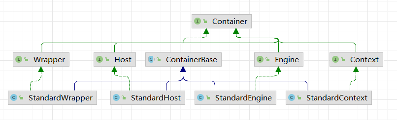
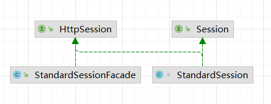
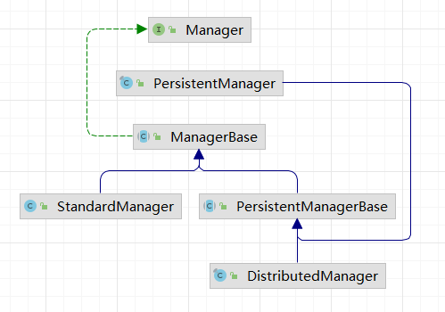
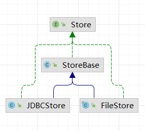
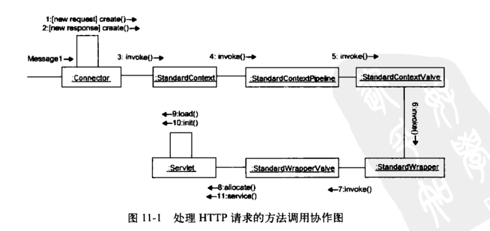
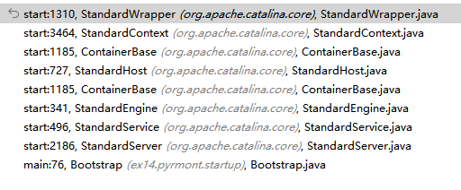
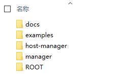
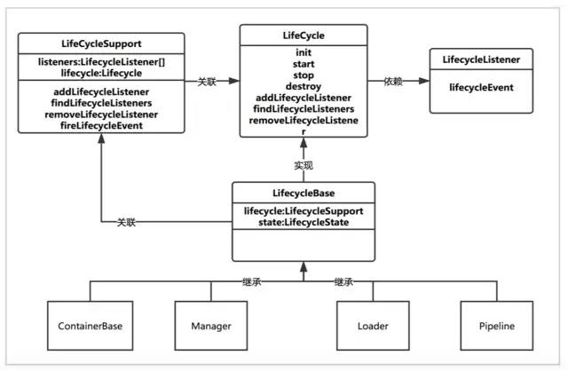
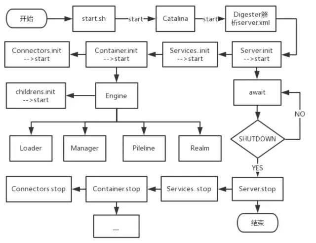
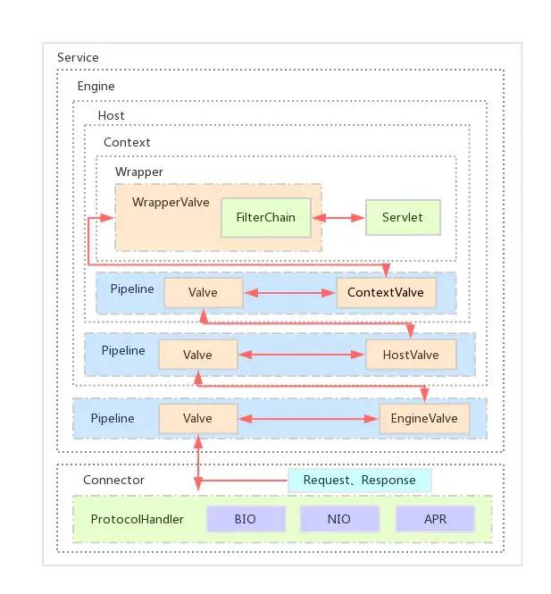

## 深入剖析 tomcat


### 1. 一个简单的Web 服务器


#### 1.1 HTTP

http 请求：请求方法，请求头，空行，请求体

http 响应：协议，状态码，描述，响应头，空行，响应体

uri：相对于服务器根目录的相等路径，以 "/" 开头

url：统一资源定位符，是 uri 的一种


#### 1.2 java.net.Socket

客户端端套接字：网络连接的端点，可以使应用程序从网络中读取/写入数据；


#### 1.3 java.net.ServerSocket

服务端套接字：等待(accept)来自客户端的请求，请求过来后创建一个 Socket 处理与客户端的通信


#### 1.4 应用程序


### 2. 一个简单的 servlet 容器


#### 2.1 javax.servlet.Servlet 接口


### 3. 连接器

**Catalina = 连接器(等待 http 请求) + 容器(创建 request 和 response 对象)**

连接器：servlet2.3 中连接器必须创建 `javax.servlet.http.HttpServletRequest` 和`javax.servlet.http.HttpServletResponse`，并传递给被调用的 servlet 的 service 方法


### 4. Tomcat4 的默认连接器

- 实现 `org.apache.catalina.Connector` 接口
- 创建实现类 `org.apache.catalina.Request` 接口的对象
- 创建实现类 `org.apache.catalina.Response` 接口的对象

等待 http 请求，创建 request， response 对象，调用 `org.apache.cataline.Container#invoke` 方法将两个对象传递给 servlet，invoke 方法内载入响应的 servlet 类，调用 service 方法，管理 session 对象，记录错误消息等；


#### 4.1 http1.1 的新特性

- 长连接 `connection: keep-alive`

- 块编码 `transfer-encoding`

  块长度 \n\r

  块内容 \n\r

  块长度\n\r

  块内容\n\r

  0\n\r

- 状态码 100 的使用 `客户端发送expect: 100-continue`  `服务器返回 http/1.1 100 continue`

  当客户端准备发送-一个较长的请求体，而不确定服务端是否会接收时，就可能会发送上面的头信息。若是客户端发送了较长的请求体，却发现服务器拒绝接收时，会是较大的浪费。


#### 4.2 Connector 接口

`org.apache.catalina.Connector` 

- setContainer：将连接器 和 servlet 管理
- getContainer：返回当前连接器关联的 servlet
- createRequest：创建 request 对象
- createResponse：创建 response 对象


#### 4.3 HttpConnector 类

- 创建服务器套接字

- 维护 HttpProcessor 实例

  使用实例池，进行重用

- 提供 http 请求服务

  获取一个 HttpProcessor 进行处理


#### 4.4 HttpProcessor 类

需要**异步**来同时处理多个 http 请求


#### 4.5/6 Request/Response 对象


#### 4.7 处理请求

- 解析连接
- 解析请求
- 解析请求头


### 5. servlet 容器

- engine
- host
- context
- wrapper

(存放 servlet 实例)

#### 5.1 org.apache.catalina.Container 接口

Catalina 中有四种类型的容器

容器中可以包含一些支持的组件：载入器(loader)，记录器(logger)，管理器(manager)，领域(realm)，资源(resources)




#### 5.2 管道任务

管道：管道包含该 servlet容器 将要调度的任务

阀：一个阀表示一个具体的执行任务(向基础阀(**最后**调用)中添加其它的阀)

一个 servlet容器可以有一条管道。当调用了容器的 invoke() 方法后，容器会将处理工作交由管道完成，而管道会调用其中的第1个阀开始处理。当第1个阀处理完后，它会调用后续的阀继续执行任务，直到管道中所有的阀都处理完成。(类似于过滤器)

**wrapper 实例中的基础阀负责调用 servlet 实例的 service 方法**

tomcat 使用 `org.apache.catalina.ValveContext#invokeNext` 实现阀的遍历执行


- `org.apache.catalina.Pipeline`

  servlet容器 调用 invoke 方法开始调用管道中的阀 和 基础阀

- `org.apache.catalina.Valve`

  阀

- `org.apache.catalina.ValveContext`

- `org.apache.catalina.Container`

  阀 通过实现该接口可以与一个 servlet容器 关联


#### 5.3 Wrapper 接口

最低级的容器，不能再添加子容器了；负责管理 servlet 类的生命周期(init, service, destroy...)

- org.apache.catalina.Wrapper#load：初始化并载入 servlet 类
- org.apache.catalina.Wrapper#allocate：分配一个已载入的 servlet 实例


#### 5.4 Context 接口

可以添加一个或多个 Wrapper 作为子容器


#### 5.5 应用程序

当程序中有多个 wrapper 实例时，tomcat4 中使用 org.apache.catalina.Mapper 映射器来选择子容器处理某个指定的请求


#### 5.6 Context 应用程序

- 容器包含一条管道，容器的 invoke() 方法会调用管道的 invoke() 方法:
- 管道的 invoke() 方法会调用所有添加到其容器中的阀，然后再调用其基础阀的 invoke() 方法; .
- 在 Wrapper 实例中，**基础阀负责载入相关联的servlet类**，并对请求进行响应;
- 在包含子容器的 Context 实例中，**基础阀使用映射器来查找一个子容器**，该子容器负责处理接收到的请求。若找到了相应的子容器，则调用其invoke() 方法，转到步骤 1) 继续执行。


### 6. 生命周期


#### 6.1 Lifecycle 接口

通过父组件统一管理子组件的生命周期


#### 6.2 LifecycleEvent 类

生命周期事件


#### 6.3 LifecycleListener 接口

生命周期事件监听器


#### 6.4 LifecycleSupport 类

帮助组件管理监听器，触发相应的生命周期事件


#### 6.5 应用程序


### 7. 日志记录器


#### 7.1 org.apache.catalina.Logger 接口

所有的日志记录器都要实现该接口


#### 7.2 日志记录器

- 父类 LoggerBase

  子类需要重写 public abstract void log(String msg); 方法

- FileLogger：将信息写入文件
- SystemErrLogger：System.out.println(msg)
- SystemOutLogger：System.err.println(msg);


### 8. 载入器


#### 8.1 java 的类载入器

- 启动类加载器
- 扩展类加载器
- 应用程序类加载器


#### 8.2 org.apache.catalina.Loader 接口

web 应用程序载入器，有一个自定义的类加载器

载入器通常与 Context 级别的容器相关联

载入器支持修改后类的重新载入，默认为禁用

```xml
<!-- 在 server.xml 中添加如下元素 -->
<Context path="/app" docBase="app" debug="0" reloadable="true"/>
```

当与某个载入器相关联的容器需要使用某个servlet 类时，即当该类的某个方法被调用时，容器会先调用载入器的getClassLoader() 方法来获取类载入器的实例。然后，容器会调用类载入器的 loadClass() 方法来裁入这个servlet类。


#### 8.3 org.apache.catalina.loader.Reloader 接口

- modified：某个类是否被修改
- addRepository：添加仓库
- findRepository：返回实现了 Reloader 接口的类载入器的所有仓库


#### 8.4 org.apache.catalina.loader.WebappLoader 类

载入器，负责载入 web 应用程序中所用到的类

该类创建一个 org.apache.catalina.loader.WebappClassLoader 作为类载入器

通过实现 java.lang.Runnable 接口不断的调用载入器的 modified 方法，如果发现类被修改通知载入器相关联的 servlet容器(Context)，由容器完成类的重新载入

- 创建类加载器
- 设置仓库：/WEB-INF/classes，/WEB-INF/lib
- 设置类路径
- 设置访问权限
- 开启新线程执行类的重新载入


#### 8.5 org.apache.catalina.loader.WebappClassLoader 类

类载入器，某些包下的类是不允许载入的

- 类缓存

  保存已载入 和 载入失败的类，作为 资源(org.apache.catalina.loader.ResourceEntry) 存储

- 类载入

  


### 9. Session 管理

通过 Session管理器 管理创建的 session 对象


#### 9.1 Session 对象



StandardSession 类

创建 session 对象必须给一个管理器实例

StandardSessionFacade 类

为了传递一个 Session 对象给 servlet 实例，Catalina 会实例化 StandardSession 类，填充该 Session 对象，然后再将其传给 servlet 实例。但是，实际上，Catalina 传递的是 Session 的外观类 StandardSessionFacade 的实例，该类仅仅实现了 javax.servlet.http.HttpSession 接口中的方法。这样，servlet 程序员就不能将HttpSession对象向下转换为StandardSession类型，也阻止了servlet 访问一些敏感方法


#### 9.2 Manager



org.apache.catalina.session.StandardManager 一个标准实现，实现了 Lifecycle 接口，可以通过容器启动关闭；实现了 Runnable 接口来销毁失效的对象

PersistentManagerBase 类可以将 session 进行持久化，需要完成备份 和 换出 session

- 换出

  只有当活动 Session 对象的数量超过了变量 maxActiveSessions 指定的上限值，或者该 Session 对象闲置了过长时间后，才会换出它。

  - 当内存中有过多的 Session 对象时，PersistentManagerBase 实例会直接将Session对象换出，直到当前活动Session对象的数量等于变量maxActiveSessions指定的数值(参见processMaxActiveSwaps()方法)。

  - 当某个Session对象闲置了过长时间时，PersistentManagerBase类会依据两个变量的值来决定是否将这个Session对象换出

    这两个变量分别是 minIdleSwap 和 maxldleSwap.如果某个 Session 对象的 lastAccessedTime 属性的值超过了 minIdleSwap 和 maxIdleSwap 的值，就会将这个 Session 对象换出。为了防止换出 Session 对象，可以将变量 maxldleSwap 的值置为负数(参见 processMaxIdleSwaps() 方法)。

- 备份

  只会备份那些空闲时间超过了 maxIdleBackup 指定的值的 session 对象


#### 9.3 存储器

org.apache.catalina.Store 完成持久化存储功能

save：将指定 session 存储到某种持久性存储器中

load：从存储器中将 session 载入到内存




当调用 getSession() 方法时，request 对象必须调用与 Context 容器相关联的 Session管理器。Session 管理器组件要么创建-一个新的 session 对象，要么返回一个已经存在的 session 对象。request 对象为了能够访问 Session 管理器，它必须能够访问 Context 容器。


### 10. 安全性

servlet容器是通过一个名为验证器的阀来支持安全限制的。当servlet容器启动时，验证器阀会被添加到Context容器的管道中。

在调用Wrapper阀之前，会先调用验证器阀，对当前用户进行身份验证。如果用户输入了正确的用户名和密码，则验证器阀会调用后续的阀，继续显示请求的servlet。如果用户未能通过身份验证，则验证器阀会返回，而不会调用后面的阀。身份验证失败的话，用户就无法查看请求的servlet资源了。


- 领域

  org.apache.catalina.Realm

  领域对象用来对用户进行身份验证的组件。它会对用户输入的用户名和密码对进行有效性判断。领域对象通常都会与一个Context容器相关联，而一个Context容器也只能有一个领域对象。可以调用Context容器的setRealm()方法来将领域对象与该Context容器相关联。

  它保存了所有有效用户的用户名和密码对，或者它会访问存储这些数据的存储器。这些数据的具体存储依赖于领域对象的具体实现。在Tomcat中，有效用户信息默认存储在tomcat-user.xml文件中。但是可以使用其他的领域对象的实现来针对其他资源验证用户身份，例如查询-一个关系数据库。

- 主体

  java.security.Principal 实现类 GenericPrinciple ，需要与一个领域对象相关联

- 登录配置

  LoginConfig，包含 领域对象名，身份验证方法

- 验证器

  Authenticator 这是一个 **阀**

- 安装验证器阀


### 11. StandardWrapper

每个 wrapper 代表一个具体的 servlet 定义


#### 11.1 方法调用序列





1. 连接器创建 request 和 response 对象;
2. 连接器调用StandardContext实例的invoke()方法:
3. 接着, StandardContext 实例的 invoke() 方法调用其管道对象的invoke() 方法。StandardContext 中管道对象的基础阀是 StandardContextValve 类的实例，因此，StandardContext 的管道对象会调用StandardContextValve实例的 invoke() 方法;
4. StandardContextValve 实例的 invoke() 方法获取相应的 Wrapper 实例处理HTTP请求，调用 Wrapper 实例的 invoke() 方法;
5. StandardWrapper 类是 Wrapper 接口的标准实现，StandardWrapper 实例的 invoke() 方法会调用其管道对象的 invoke() 方法:
6. StandardWrapper 的管道对象中的基础阀是 StandardWrapperValve 类的实例，因此，会调用StandardWrapperValve 的 invoke() 方法，StandardWrapperValve 的 invoke() 方法调用 Wrapper 实例的allocate() 方法获取 servlet 实例;
7. allocate() 方法调用 load() 方法载人相应的 servlet 类，若已经载入，则无需重复载入;
8. load() 方法调用 servlet 实例的 init() 方法;
9. StandardWrapperValve 调用 servlet 实例的 service() 方法。


- StandardContext 的构造函数会设置 StandardContextValve 类的一个实例作为其基础阀；

- StandardWrapper 的构造函数会设置 StandardWrapperValve 类的一个实例作为其基础阀;


#### 11.2 SingleThreadModel

~~已被废弃：servlet 实现 javax.servlet.SingleThreadModel 类保证一次只处理一个请求，(如果使用了静态变量，不能保证线程安全)~~


#### 11.3 StandardWrapper

- StandardWrapper：**载入(载入器)并实例化 servlet**，调用 init

- StandardWrapperValve：调用 allocate 方法从 StandardWrapper 中获取 servlet 实例，调用 servlet#service 方法

- ServletConfig：调用 servlet#init 方法时需要传入该对象(实际传入的是一个外观类)

  - getServletContext：获取 wrapper 所在的 context (wrapper 必须放置在某个 context 容器中，并且不能有子容器)
  - getInitParameter：初始化参数存储在一个 HashMap 中

  

#### 11.4 StandardWrapperFacade

调用 init 方法时传入的外观类


#### 11.5 StandardWrapperValve

基础阀

- 执行与该 servlet 关联的所有过滤器
- 调用 servlet#service 方法

基础阀中 invoke 方法的逻辑

1. 调用 StandardWrapper 实例的 allocate() 方法获取该 StandardWrapper 实例所表示的servlet
   实例:
2. 调用私有方法 createFilterChain()，创建过滤器链（ApplicationFilterChain）:
3. 调用过滤器链的 doFilter() 方法，其中包括调用 servlet 实例的 service()方法;
4. 释放过滤器链;
5. 调用Wrapper实例的 deallocate() 方法: 
6. 若该 servlet 类再也不会被使用到，则调用 Wrapper 实例的 unload() 方法。


#### 11.6 FilterDef

过滤器定义


#### 11.7 ApplicationFilterConfig

管理第一次启动时创建的所有过滤器实例，需要 Context 和 FilterDef

getFilter：负责载入过滤器并实例化


#### 11.8 ApplicationFilterChain

StandardWrapperValve 对象会调用 invoke 方法创建该对象，并调用 doFilter 方法调用第一个过滤器，调用完最后一个调用 service 方法


### 12. StandardContext

context 需要其它组件支持(载入器，session 管理器)


#### 12.1 StandardContext 配置

创建该对象后调用 start 方法为每个 http 请求提供服务

- 创建并配置成功后会读取解析 %CATALINA_HOME%/conf/web.xml 文件 (该文件的内容会应用到所有部署到 tomcat 中的应用程序，保证 StandardContext 可以处理应用程序级别的 web.xml 文件)
- 配置基础阀(StandardContextValve) 和 许可阀


org.apache.catalina.core.StandardContext#start

- 触发 BEFORE_START 事件
- 将 availability 属性设置为 false
- 将 configured 属性设置为 false
- 配置资源
- 设置载入器
- 设置 Session管理器
- 初始化字符集映射器
- 启动与该 Context容器 相关联的组件
- 启动子容器
- 启动管道对象
- 启动 Session管理器
- 触发 START 事件，在这里监听器(ContextConfig 实例)会执行一些配置操作，若设置成功，ContextConfig 实例会将StandardContext实例的 configured 变量设置为true
- 检查 configured 属性的值，若为 true,则调用 postWelcomePages() 方法，载人那些需要在启动时就载入的子容器，即Wrapper实例，将 availability 属性设置为 true.若 configured 变量为 false ,则调用stop()方法
- 触发AFTER_ START事件。


invoke 方法由与其关联的 连接器 或 父容器host 调用


#### 12.2 StandardContextMapper

StandardContextValve 基础阀，调用 context 的 map 方法，根据协议返回映射器；

StandardContextMapper 映射器，必须与 context 容器相关联，通过 map 方法返回一个 wrapper 处理请求，

对于每个引入的HTTP请求，都会调用 StandardContext 实例的管道对象的基础阀的 invoke() 方法来处理。StandardContext 实例的基础阀是 org. apache.catalina.core.StandardContextValve 类的实例。StandardContextValve 类的invoke() 方法要做的第一件事是获取一个要处理HTTP请求Wrapper实例。


#### 12.3 对重载的支持

通过载入器实现，当 web.xml 或 WEB-INF/classes 下的文件发生变化时，会重新载入


#### 12.4 backgroundProcess()

tomcat5 中一些后台处理任务共享同一个线程

- 载入器需要周期性的检查类是否被修改
- session 管理器需要周期性的检查是否由对象过期


### 13. Host 和 Engine


#### 13.1 Host 接口

map 方法返回 一个 context 处理请求 


#### 13.2 StandardHost

基础阀 StandardHostValve，调用 start 方法时会加入两个阀 ErrorReportValve, ErrorDispatcherValve

请求过来后，会调用 invoke 方法，

map 方法获取相应的 context 实例处理 http 请求


#### 13.3 StandardHostMapper

映射器


#### 13.4 StandardHostValve

基础阀，请求过来后会调用 invoke(request, response, valueContext) 方法进行处理，调用 StandardHost 的 map 方法获取一个 context，然后获取 request 对应的 session，修改最后访问时间；最后调用 Context 的 invoke 方法处理请求


#### 13.5 必须有一个 Host容器

如果一个 context 使用 ContextConfig 对象进行设置，必须使用一个 Host 对象

ContextConfig 会读取 web.xml 文件，里面用到了 Host


#### 13.7 Engine

部署 tomcat 时需要支持多个虚拟机的话需要用到 Engine 容器

可以设置默认的 Host 或 Context，但是子容器只能是 Host，不能有父容器


#### 13.8 StandardEngine

构造函数中会添加基础阀 StandardEngineValve


#### 13.9 StandardEngineValve

基础阀：验证一下 request 和 response，调用 map 方法得到一个 Host，调用 invoke 方法处理请求


### 14. 服务器组件 和 服务组件


#### 14.1 服务器组件

org.apache.catalina.Server 接口表示 catalina 的整个 servlet 引擎，使用一种方法来 启动/关闭 系统(不需要分别处理 连接器，处理器)


#### 14.2 StandardServer

可以向服务器组件中 添加/删除/查找 服务组件，有四个生命周期相关的方法，可以初始化并启动服务器组件

- initialize：初始化添加的服务器组件，只会初始化一次
- start：启动服务器组件
- stop：关闭服务器组件
- await：等待关闭整个 tomcat 的命令(创建一个 ServerSocket，默认监听 8085 端口，)


#### 14.3 Service

服务组件：一个服务组件可以有一个 servlet容器 和 多个连接器


#### 14.4 StandardService

- 一个 servlet 容器
- 多个 连接器：可以处理不同的协议 (http, https)

生命周期方法

- initialize：调用服务组件中所有连接器的 initialize 方法
- start：启动被添加到该服务组件中的连接器 和 servlet容器
- stop：关闭与该服务组件相关联的 servlet容器 和 所有连接器





### 15. Digester

使用 server.xml 文件避免手动创建设置对象


#### 15.1 使用 Digester 库解析 xml


#### 15.2 ContextConfig 类

StandardContext 需要一个监听器，用来配置 StandardContext 实例 (设置 configured 变量)

使用 Digester 读取解析 web.xml 文件，为每个 servlet 元素创建一个 StandardWrapper


### 16. 关闭钩子

虚拟机在执行关闭阶段会启动所有已注册的关闭钩子

```java
// 注册关闭钩子
Runtime.getRuntime().addShutdownHook(new Thread() {
    @Override
    public void run() {
        System.out.println("hook");
    }
});
```

tomcat 的关闭钩子会调用 Server 对象的 stop 方法，执行关闭操作


### 17. 启动 Tomcat

- Bootstrap：负责创建 Catalina 对象，调用 process 方法
- Catalina：负责启动 或 关闭 Server，解析配置文件


#### 17.1 Catalina

Catalina类包含一个 Digester 对象，用来解析 server.xml，封装了-一个Server对象，该对象有一个Service 对象。Service 对象包含有一个Servet容器和一个或多个连接器。可以使用Catalina类来启动关闭Server对象。

- start：

  创建一个 Digester 实例来解析 server.xml 文件；Catalina 对象的 start() 方法会调用 Server 对象的 await() 方法，Server 对象会使用一个专用的线程来等待关闭命令。await() 方法会循环等待，直到接收到正确的关闭命令。当 await() 方法返回时，Catalina 对象的 start() 方法会调用 Server 对象的 stop() 方法，从而关闭Server 对象和其他的组件。此外，start() 方法还会利用关闭钩子，确保用户突然退出应用程序时会执行Server 对象的stop() 方法。

- stop：

  stop() 方法用来关闭 Catalina 和 Server 对象


#### 17.2 Bootstrap

运行 main 方法，调用 Catalina#process 方法

创建三个载入器 (放置应用程序使用 WEB-INF/classes 和 WEB-INF/lib 之外的类)，然后创建一个 Catalina，最后调用 process 方法


#### 17.3 在 Windows 和 Unix 平台上通过脚本 启动/关闭


### 18. 部署器

当在server.xml 文件中遇到符合"Server/Servicc/Enginc/Host"模式的标签时，会创建`org.apache.catalina.startup.HostConfig` 类的一个实例，并将其添加到Host实例中，作为生命周期监听器。换句话说，HostConfig类会处理StandardHost实例的start()方法和stop() 发触发的事件。HostConfig类的lifecycleEvent() 方法是一个事件处理程序。因为HostConfig的实例是StandardHost实例的监听器，每当StandardHost实例启动或关闭时，都会调用lifecycleEvent()方法。

Context 容器使用 war 形式来部署，需要放到 Host 中；在 StandardHost 中使用 HostConfig 类型的生命周期监听器

当调用 StandardHost 实例的 start() 方法时，它会触发 START 事件。HostConfig 实例会对此事件进行相应，并调用其自身的 start() 方法，该方法会逐个部署并安装指定目录中的所有 Web 应用程序。

- 部署描述符
- 部署 war
- 部署目录


#### 18.2 Deploy 接口

StandardHost 不仅是一个 容器 也是一个 部署器


#### 18.3 StandardHostDeployer

一个辅助类，完成将 web 应用程序部署到 StandardHost 的工作


### 19. Manager应用程序的servlet类


### 20. 基于JMX的管理


---

### 拾遗


#### tomcat 结构 

```xml
<?xml version='1.0' encoding='utf-8'?>

<Server port="8005" shutdown="SHUTDOWN">
  <!-- 自带的监听器 -->
  <!-- 启动时，检查APR库，如果存在则加载。APR，即Apache Portable Runtime，是Apache可移植运行库，可以实现高可扩展性、高性能，以及与本地服务器技术更好的集成。 -->
  <Listener className="org.apache.catalina.core.AprLifecycleListener" SSLEngine="on" />
  <!-- 在Web应用启动之前初始化Jasper，Jasper是JSP引擎，把JVM不认识的JSP文件解析成java文件，然后编译成class文件供JVM使用 -->
  <Listener className="org.apache.catalina.core.JasperListener" />
  <!-- 与类加载器导致的内存泄露有关 -->
  <Listener className="org.apache.catalina.core.JreMemoryLeakPreventionListener" />
  <!-- 通过该监听器，初始化< GlobalNamingResources>标签中定义的全局JNDI资源；如果没有该监听器，任何全局资源都不能使用 -->
  <Listener className="org.apache.catalina.mbeans.GlobalResourcesLifecycleListener" />
    <!-- 当Web应用因thread-local导致的内存泄露而要停止时，该监听器会触发线程池中线程的更新。当线程执行完任务被收回线程池时，活跃线程会一个一个的更新。只有当Web应用(即Context元素)的renewThreadsWhenStoppingContext属性设置为true时，该监听器才有效 -->
  <Listener className="org.apache.catalina.core.ThreadLocalLeakPreventionListener" />

  <GlobalNamingResources>
    <Resource name="UserDatabase" auth="Container"
              type="org.apache.catalina.UserDatabase"
              description="User database that can be updated and saved"
              factory="org.apache.catalina.users.MemoryUserDatabaseFactory"
              pathname="conf/tomcat-users.xml" />
  </GlobalNamingResources>

  <Service name="Catalina">
    <!-- redirectPort 表示当强制要求https而请求是http时，重定向至端口号为8443的 Connector -->
    <Connector port="8080" protocol="HTTP/1.1"
               connectionTimeout="20000"
               redirectPort="8443" URIEncoding="UTF-8" maxParameterCount="-1"/>
    <!-- 客户端可以通过8009端口号使用AJP协议访问Tomcat。AJP协议负责和其他的HTTP服务器(如Apache)建立连接；在把Tomcat与其他HTTP服务器集成时，就需要用到这个连接器。之所以使用Tomcat和其他服务器集成，是因为Tomcat可以用作Servlet/JSP容器，但是对静态资源的处理速度较慢，不如Apache和IIS等HTTP服务器；因此常常将Tomcat与Apache等集成，前者作Servlet容器，后者处理静态资源，而AJP协议便负责Tomcat和Apache的连接 -->
    <Connector port="8009" protocol="AJP/1.3" redirectPort="8443" />

    <!-- name属性用于日志和错误信息，在整个Server中应该唯一。defaultHost属性指定了默认的host名称，当发往本机的请求指定的host名称不存在时，一律使用defaultHost指定的host进行处理；因此，defaultHost的值，必须与Engine中的一个Host组件的name属性值匹配 -->
    <Engine name="Catalina" defaultHost="localhost">
    
      <Realm className="org.apache.catalina.realm.LockOutRealm">
        <!-- resourceName 是上面 GlobalNamingResources 中定义的 -->
        <Realm className="org.apache.catalina.realm.UserDatabaseRealm"
               resourceName="UserDatabase"/>
      </Realm>

      <!-- 每个Host组件代表Engine中的一个虚拟主机。Host组件至少有一个，且其中一个的name必须与Engine组件的defaultHost属性相匹配 -->
      <!-- unpackWARs指定了是否将代表Web应用的WAR文件解压；如果为true，通过解压后的文件结构运行该Web应用，如果为false，直接使用WAR文件运行Web应用 -->
      <Host name="localhost"  appBase="webapps"
            unpackWARs="true" autoDeploy="true">
        <!-- 阀，AccessLogValve的作用是通过日志记录其所在的容器中处理的所有请求，在本例中，Valve放在Host下，便可以记录该Host处理的所有请求 (可以与Engine、Host或Context关联) -->
        <Valve className="org.apache.catalina.valves.AccessLogValve" directory="logs"
               prefix="localhost_access_log." suffix=".txt"
               pattern="%h %l %u %t &quot;%r&quot; %s %b" />

      </Host>
    </Engine>
  </Service>
</Server>

```

请求过来时：

1. 根据协议和端口号选定 Service 和 Container
2. 根据域名或IP地址选定 Host
3. 根据 URI 选定 Context/Web 应用


**tomcat 结构**

- server：最顶层，只能有一个(可以配置多个 Service 服务，可以实现通过不同的端口号来访问同一台机器上部署的不同 Web 应用)，需要处理生命周期相关，监听 8005 端口发过来的 shutdown 命令，用 于关闭整个容器
- service：可以有多个，包含 connector(连接器，可以有多个) 和 engine (容器)，各 个 Service 之间是独立的，但是共享同一 JVM 的资源 
- connector：接受请求，创建 request 和 response 对象，传给 engine
- container (engine)：只能有一个，接收 connector 中的请求并处理返回
- loader：封装了 Java ClassLoader，用于 Container 加载类文件
- realm：为 web 应用程序提供访问认证和角色管理的机制
- jmx：Java SE 中定义技术规范，是一个为应用程序、设备、系统等植入管理功能的框架，通过 JMX 可以远程监控 Tomcat 的运行状态
- jasper：Tomcat 的 Jsp 解析引擎，用于将 Jsp 转换成 Java 文件，并编译成 class 文件
- session：负责管理和创建 session，以及 Session 的持久化，集群
- pipeline：在容器中充当管道的作用，管道中可以设置各种 valve(阀门)，请求和响应在经由管 道中各个阀门处理，提供了一种灵活可配置的处理请求和响应的机制
- naming：命名服务，JNDI， Java 命名和目录接口，是一组在 Java 应用中访问命名和目录服务的 API。命名服务将名称和对象联系起来，使得我们可以用名称访问对象，目录服务也是一种命名服务，对象不但有名称，还有属性。Tomcat 中可以使用 JNDI 定义数据源、配置信息，用于开发 与部署的分离


**容器 container 组成**：

- engine：Servlet 的顶层容器，包含一 个或多个 Host 子容器

- host：每个Host组件代表 Engine 中的一个虚拟主机，并负责安装、展开、启动和结束每个Web应用，context 的创建

  **自动检测更新参数**

  - deployOnStartup：为true时，Tomcat在启动时检查Web应用，且检测到的所有Web应用视作新应用；
  - autoDeploy：为true时，Tomcat在运行时定期检查新的Web应用或Web应用的更新。

  自动部署依赖于检查是否有新的或更改过的 Web 应用，而 Host 元素的 appBase 和 xmlBase 设置了检查 Web应用更新的目录

  **自动检测目录**

  - appBase：属性指定 Web 应用所在的目录，默认值是 `webapps`，这是一个相对路径，代表 `Tomcat` 根目录下 `webapps` 文件夹。

  - xmlBase：属性指定 Web应用的XML配置文件所在的目录，默认值为`conf/<engine_name>/<host_name>`，例如第一部分的例子中，主机 `localhost` 的 `xmlBase` 的默认值是`$TOMCAT_HOME/conf/Catalina/localhost`

  检测顺序

  - 扫描虚拟主机指定的 `xmlBase` 下的XML配置文件
  - 扫描虚拟主机指定的 `appBase` 下的WAR文件
  - 扫描虚拟主机指定的 `appBase` 下的应用目录

- context

  每个Context组件代表在特定Host上运行的一个Web应用，负责 web 配置的解析、管理所有的 Web 资源

  - docBase 指定了该 Web 应用使用的 WAR 包路径，或应用目录。需要注意的是，在自动部署场景下(配置文件位于xmlBase中)，`docBase`不在`appBase`目录中，才需要指定；如果`docBase`指定的WAR包或应用目录就在`docBase`中，则不需要指定，因为`Tomcat`会自动扫描`appBase`中的WAR包和应用目录，指定了反而会造成问题

  - **上下文路径**：在自动部署场景下(配置文件位于xmlBase中)，不能指定path属性，path属性由配置文件的文件名、WAR文件的文件名或应用目录的名称**自动推导**出来。如扫描Web应用时，发现了xmlBase目录下的app1.xml，或appBase目录下的app1.WAR或app1应用目录，则该Web应用的path属性是”app1”。如果名称不是app1而是ROOT，则该Web应用是虚拟主机默认的Web应用，此时path属性推导为””
  - reloadable：属性指示tomcat是否在运行时监控在`WEB-INF/classes`和`WEB-INF/lib`目录下class文件的改动。

  ```xml
  <!-- 静态部署 -->
  <Context docBase="D:\Program Files\app1.war" reloadable="true"/>
  ```

- warpper：是对 Servlet 的封装，负责 Servlet 实例的创 建、执行和销毁

  

  tomcat默认webapps目录

  - http://localhost:8080/：访问的是 ROOT 对应的Web应用
  - http://localhost:8080/docs：访问 docs 应用
  - http://localhost:8080/examples/：...

  

  静态部署：

  - docBase：docBase可以在appBase目录下，也可以不在；本例中，docBase不在appBase目录下
  - path：可以显式指定path属性，但是仍然受到了严格的限制：只有当自动部署完全关闭(`deployOnStartup`和`autoDeploy`都为`false`)或`docBase`不在`appBase`中时，才可以设置path属性


**生命周期管理**

生命周期管理引入了事件机制，在组件或容器的生命周期状态发生变化时会通 知事件监听器

监听器通过判断事件的类型来进行相应的操作。事件监听器的添加可以在 server.xml 文件中进行配置

各类容器的配置过程就是通过添加 listener 的方式来进行的，从而达到配置逻辑与 容器的解耦

- EngineConfig：主要打印启动和停止日志
- HostConfig：处理部署应用，解析应用 META-INF/context.xml 并创建应用的 Context
- ContextConfig：解析并合并 web.xml，扫描应用的各类 web 资源 (filter、servlet、listener)




**启动过程**

Tomcat 的启动过程




- 启动从 Tomcat 提供的 start.sh 脚本开始，shell 脚本会调用 Bootstrap 的 main 方法，实际 调用了 Catalina 相应的 load、start 方法。

- load 方法会通过 Digester 进行 config/server.xml 的解析，在解析的过程中会根据 xml 中的关系 和配置信息来创建容器，并设置相关的属性。接着 Catalina 会调用 StandardServer 的 init 和 start 方法进行容器的初始化和启动。

- 按照 xml 的配置关系，server 的子元素是 service，service 的子元素是顶层容器 Engine，每层容器有持有自己的子容器，而这些元素都实现了生命周期管理 的各个方法，因此就很容易的完成整个容器的启动、关闭等生命周期的管理。

- StandardServer 完成 init 和 start 方法调用后，会一直监听来自 8005 端口(可配置)，如果接收 到 shutdown 命令，则会退出循环监听，执行后续的 stop 和 destroy 方法，完成 Tomcat 容器的 关闭。同时也会调用 JVM 的 Runtime.getRuntime().addShutdownHook 方法，在虚拟机意外退 出的时候来关闭容器。

- 所有容器都是继承自 ContainerBase，基类中封装了容器中的重复工作，负责启动容器相关的组 件 Loader、Logger、Manager、Cluster、Pipeline，启动子容器(线程池并发启动子容器，通过 线程池 submit 多个线程，调用后返回 Future 对象，线程内部启动子容器，接着调用 Future 对象 的 get 方法来等待执行结果)。


**Web 应用的部署方式**

- `server.xml` 配置 `Host `元素，指定 `appBase `属性，默认`$catalina.base/webapps/`
- `server.xml` 配置 `Context `元素，指定 `docBase`，元素，指定 web `应用`的路径
- 自定义配置：在`$catalina.base/EngineName/HostName/XXX.xml `配置 `Context `元素

`HostConfig `监听了 `StandardHost `容器的事件，在 `start `方法中解析上述配置文件

- 扫描 `appBase `路径下的所有文件夹和 war 包，解析各个应用的 `META-INF/context.xml`，并创建 `StandardContext`，并将 Context 加入到 Host 的子容器中。
- 解析`$catalina.base/EngineName/HostName/`下的所有 Context 配置，找到相应 web 应 用的位置，解析各个应用的 `META-INF/context.xml`，并创建 `StandardContext`，并将 Context 加入到 Host 的子容器中。
  - HostConfig 并没有实际解析 `context.xml`，而是在 ContextConfig 中进行的。
  - HostConfig 中会定期检查 watched 资源文件(`context.xml` 配置文件)

ContextConfig 解析 `context.xml` 顺序：

- 先解析全局的配置 `conf/context.xml`
- 然后解析 Host 的默认配置 `EngineName/HostName/context.xml.default`
- 最后解析应用的 `META-INF/context.xml`

ContextConfig 解析 `web.xml` 顺序：

- 先解析全局的配置` conf/web.xml`
- 然后解析 Host 的默认配置 `EngineName/HostName/web.xml.default` 接着解析应用的 `MEB-INF/web.xml`
- 扫描应用 `WEB-INF/lib/`下的 jar 文件，解析其中的 `META-INF/web-fragment.xml` 最后合并 xml 封装成 WebXml，并设置 Context
  - 扫描 web 应用和 jar 中的注解(`Filter、Listener、Servlet`)就是上述步骤中进行的。
  - 容器的定期执行：`backgroundProcess`，由 `ContainerBase `来实现的，并且只有在顶层容器 中才会开启线程。(`backgroundProcessorDelay=10` 标志位来控制)


**servlet 生命周期**

1. 请求到达 server 端，server 根据 url 映射到相应的 Servlet
2. 判断 Servlet 实例是否存在，不存在则加载和实例化 Servlet 并调用 init 方法
3. Server 分别创建 Request 和 Response 对象，调用 Servlet 实例的 service 方法(service 方法 内部会根据 http 请求方法类型调用相应的 doXXX 方法)
4. doXXX 方法内为业务逻辑实现，从 Request 对象获取请求参数，处理完毕之后将结果通过 response 对象返回给调用方
5. 当 Server 不再需要 Servlet 时(一般当 Server 关闭时)，Server 调用 Servlet 的 destroy() 方 法。


**loadOnStart 参数**

- &gt;= 0：容器启动时加载 (数字越小，优先级越高)
- < 0：请求过来时加载


**请求处理过程**



**pipeline 和 value**

每个容器的管道中都有一个必不可少的 basic valve (`StandardEngineValve、StandardHostValve、 StandardContextValve、StandardWrapperValve`),其他的都是可选的,basic valve 在管道中最 后调用,同时负责调用子容器的第一个 valve。


**jsp 生命周期**

- JSP元素代码片段：<% 代码片段 %> 
- JSP声明：<%! declaration; [ declaration; ]+ ... %>
- JSP表达式：<%= 表达式 %> 
- JSP注释：<%-- 注释 --%>
- JSP指令：  <%@ directive attribute=“value” %> 
- JSP行为：  <jsp:action_name attribute=“value” /> 
- HTML元素：html/head/body/div/p/… 
- JSP隐式对象：request、response、out、session、application、config、 pageContext、page、Exception


**JSP 元素说明 ** 

- 代码片段:包含任意量的 Java 语句、变量、方法或表达式; 
- JSP 声明:一个声明语句可以声明一个或多个变量、方法,供后面的 Java 代码使用; 
- JSP 表达式:输出 Java 表达式的值,String 形式; 
- JSP 注释:为代码作注释以及将某段代码注释掉 
- JSP 指令:用来设置与整个 JSP 页面相关的属性, <%@ page ... %>定义页面的依赖属性,比如 language、contentType、errorPage、 isErrorPage、import、isThreadSafe、session 等等 <%@ include ... %>包含其他的 JSP 文件、HTML 文件或文本文件,是该 JSP 文件的一部分,会 被同时编译执行 <%@ taglib ... %>引入标签库的定义,可以是自定义标签 JSP 行为:jsp:include、jsp:useBean、jsp:setProperty、jsp:getProperty、jsp:forward


**异步 servet**

- 客户端发送一个请求
- `servlet`容器分配一个线程来处理容器中的一个`servlet`
- `servlet`调用`request.startAsync()`，保存`AsyncContext`, 然后返回
- 任何方式存在的容器线程都将退出，但是`response`仍然保持开放
- 业务线程使用保存的`AsyncContext`来完成响应（线程池）
- 客户端收到响应

异步事件监听 (`javax.servlet.AsyncListener`)

- onStartAsync：Request调用startAsync方法时触发
- onComplete：syncContext调用complete方法时触发
- onError：处理请求的过程出现异常时触发
- onTimeout：socket超时触发


#### 类加载顺序

- Bootstrap 启动类加载器：加载 jvm 和 (jre/lib/ext 目录)

- 系统类加载器：加载 tomcat 启动的类，在 catalina.bat 中指定，位于 CATALINA_HOME/bin

- 通用类加载器：加载 tomcat 使用的一些类( servlet-api.jar )
- webapp 应用类加载器：加载 WEB-INF/lib 和 WEB-INF/classes 下的文件


1. 使用 bootstrap 引导类加载器加载
2. 使用 system 系统类加载器加载
3. 使用应用类加载器在 WEB-INF/classes 中加载
4. 使用应用类加载器在 WEB-INF/lib 中加载
5. 使用common类加载器在 CATALINA_HOME/lib 中加载 


① 如果我们是通过正常项目的maven方式来引用这个jar包，那么虚拟机会**优先加载项目**中的类A，因为应用类加载器，会优先加载项目中编译的class文件，其次才是引入的jar包。

② 如果引入的这个类是在jdk的 /lib/ext 中，那么由于双亲委派机制，扩展类加载器会有限加载它，而不是通过应用类加载器加载这个类。

③ 如果这个类放在/lib下，那么会发生虚拟机找不到这个类的情况。因为启动类加载器不会加载自定义的类

④ 如果是war包，在Tomcat环境下，Tomcat是破坏了双亲委派机制，那么具体怎么加载也需要根据引入的jar包所方的位置

其次得到的知识点：

① 双亲委派机制是一个可以定义加载类的优先级的机制。对于一些类，会根据其特有的放置位置，被有限于其他的类加载。比如 /lib 下的类会优先于 /lib/ext 的类，而 /lib/ext 则会有限于用户自定义的类

② 双亲委派机制能保证在项目中，只会存在一个最优先版本的类，如果双亲加载器已经加载过这个类了，那么其他的加载器就不会再加载了。

③ 类加载器规定了应用加载类的方式和路径位置。如果用户希望在不同的路径中加载类，那么可以尝试自定义类加载器实现


[Tomcat 在 SpringBoot 中是如何启动的](https://mp.weixin.qq.com/s/0A1HdbbXicrLFmhv_CeLDw)

[详解 Tomcat 配置文件 server.xml](https://mp.weixin.qq.com/s/QfwvvHtrC-tqan2ebjri1g)
